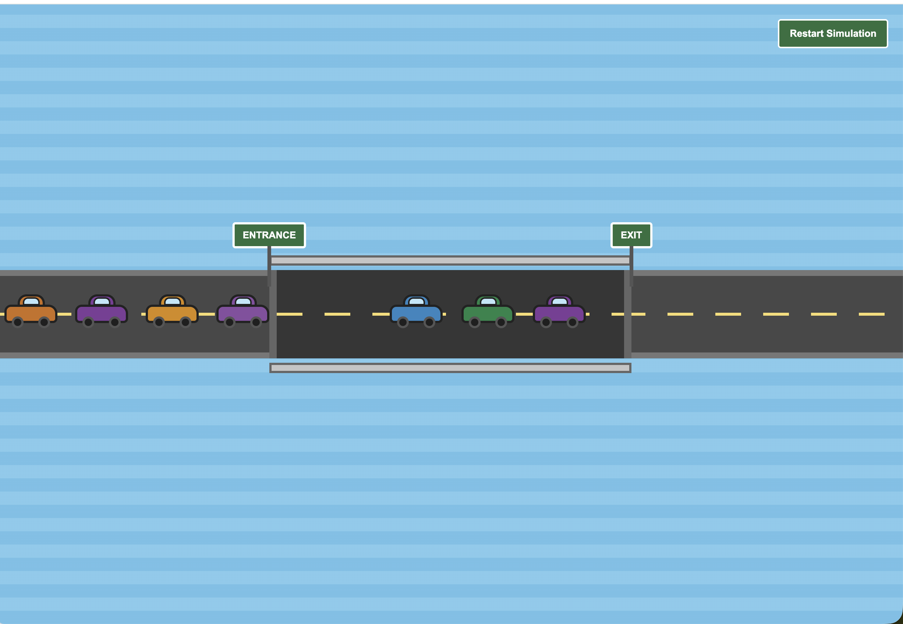

# Bridge Simulator

A local bridge simulation that manages vehicles entering and exiting a bridge with limited capacity.

Cars are created in the frontend and move toward the bridge entrance. When a car reaches the entrance, it sends a request to the backend. If the bridge is full, the request waits until another car exits and space becomes available.

<!-- Replace this path with your screenshot -->



## How It Works

The backend uses a custom blocking queue to track cars currently on the bridge.

The queue is implemented using:

* A semaphore that tracks available bridge spaces
* A semaphore that tracks cars currently available to exit
* A mutex lock that protects updates to the queue

When the bridge reaches capacity, additional entrance requests block without exceeding the bridge limit. When a car exits, a bridge space is released and one waiting car can enter.

The backend is built with FastAPI, while the frontend uses vanilla HTML, CSS, and JavaScript. Both services run locally through Docker Compose.

## Run the Simulator

Start the frontend and backend:

```bash
docker compose up --build -d
```

Open the simulator:

```text
http://localhost:8000
```

The backend API is available at:

```text
http://localhost:8001
```

FastAPI documentation:

```text
http://localhost:8001/docs
```

View the running containers:

```bash
docker compose ps
```

View logs:

```bash
docker compose logs -f
```

Stop the simulator:

```bash
docker compose down
```
